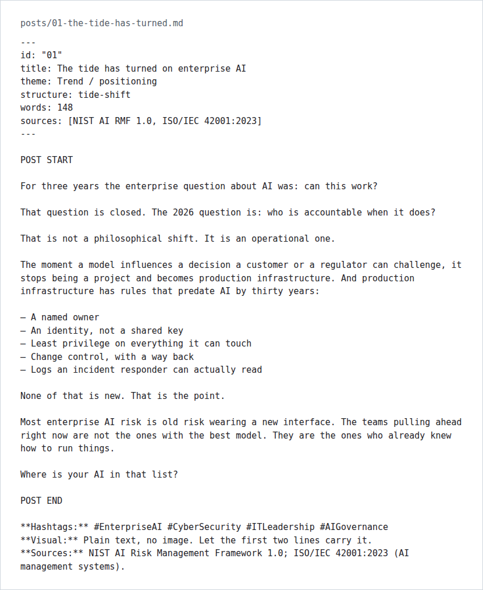

# Enterprise AI Security Kit (free sample)

Three ready-to-post LinkedIn posts on enterprise AI risk, the five post structures behind them, and every source they cite, for IT and security people who want to write about AI without inventing numbers.



*`posts/01-the-tide-has-turned.md` exactly as it is in this repo: front matter, the post between `POST START` and `POST END`, then hashtags, visual note and sources.*

 

This repo is the free sample of a paid kit of twelve posts. Everything listed below is in the repo. The rest of the kit is not.

## What it does

- **Three finished posts** (numbers 01, 03 and 12 of the twelve), each 141 to 155 words, ready to paste.
- **Front matter on every post**: id, title, theme, structure used, word count and sources.
- **Five post structures** with fill-in skeletons: Tide Shift, Mechanism, Myth / Fact, Postmortem Shape and Education / Stack, plus notes on length.
- **A source list** of the frameworks, standards and regulation the posts lean on (NIST AI RMF, ISO/IEC 42001, OWASP Top 10 for LLM Applications, MITRE ATLAS, the EU AI Act and others), each with a link.
- **No statistics.** The posts argue from public frameworks, not survey numbers. `sources/SOURCES.md` says where to get a current figure if you want one, and how to cite it.

## The thesis

Between 2023 and 2025 the enterprise question was *"can this work?"* In 2026 it is *"who is accountable when it does?"* That moves AI into the machinery every production system already lives in: identity, least privilege, change control, logging and audit. Most enterprise AI risk is old risk wearing a new interface.

## Quick start

No install. You need a text editor and a LinkedIn account.

```bash
git clone https://github.com/casareanderson/enterprise-ai-security-kit.git
cd enterprise-ai-security-kit
sed -n '/POST START/,/POST END/p' posts/01-the-tide-has-turned.md
```

That prints the post text, between its two markers, ready to copy.

## Usage

1. Pick a post and read the `sources` line in its front matter.
2. Check each source still says what the post says. The EU AI Act phases in on staggered dates, so check the current milestone before you name one.
3. Paste only the text between `POST START` and `POST END`.
4. Put any link in the first comment, not the post body.
5. To write your own, copy a skeleton from `templates/post-structures.md` and keep to its length notes.

The one rule the kit is built on:

> If you can't name where a claim comes from, cut the claim. The post is still good without it.

## How it is laid out

```
.
├── posts/
│   ├── 01-the-tide-has-turned.md                  # the opening argument (Tide Shift)
│   ├── 03-prompt-injection-is-a-privilege-problem.md   # prompt injection as privilege (Myth / Mechanism)
│   └── 12-old-risk-new-interface.md               # the closer (Tide Shift)
├── templates/post-structures.md                   # the five skeletons
├── sources/SOURCES.md                             # every framework, standard and regulation cited
└── LICENSE                                        # CC BY 4.0
```

## What is not in this repo

The paid kit has the other nine posts, a voice guide, a visual spec, a twelve-week publishing plan and two carousel outlines. None of that is here, and this README cannot vouch for it beyond the product page.

- [The Enterprise AI Security Kit](https://asareanderson.gumroad.com/l/xrintn) (30-page PDF, paid)
- [Post structures cheat sheet](https://asareanderson.gumroad.com/l/oacohs) (paid)
- [Free sampler](https://asareanderson.gumroad.com/l/vlxiyg) (these three posts, typeset; pay what you want)

## Status and limits

- Content snapshot, last changed September 2026. Frameworks and the EU AI Act timetable move, so check sources before posting.
- The posts are opinion and teaching, not legal or compliance advice.
- No engagement or reach figures exist for these posts, so none are claimed.

## Licence and credits

The sample is [CC BY 4.0](LICENSE): use it and adapt it, with credit. The frameworks and standards in `sources/SOURCES.md` belong to their publishers (NIST, ISO/IEC, OWASP, MITRE, CISA, NCSC, the EU) and are linked, not copied.

If this is useful to you, [buy me a coffee](https://buymeacoffee.com/iamc_tech) ☕
